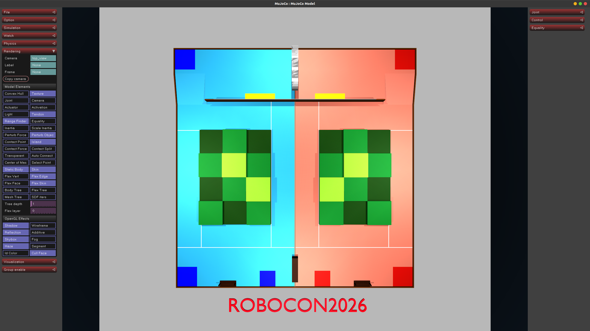

# ROBOCON2026 武林探秘 - MuJoCo仿真场景

第二十五届全国大学生机器人大赛ROBOCON"武林探秘"竞技赛MuJoCo仿真环境。



## 快速开始

### 环境要求
- Python 3.7+
- MuJoCo物理引擎

### 安装依赖
```bash
pip install mujoco
```

### 启动仿真
```bash
python -m mujoco.viewer --mjcf models/mjcf/robocon2026.xml
```

## 文件结构
```
ROBOCON2026_Scene/
├── README.md                    # 项目说明文档
├── assets/                      # 资源文件
│   └── image.png               # 场景预览图
├── models/
│   ├── meshes/                 # 3D模型文件
│   │   ├── robocon2026.obj     # 主场景模型
│   │   ├── robocon2026.mtl     # 材质文件
│   │   ├── parts/              # 场景部件模型
│   │   └── visual/             # 可视化资源
│   └── mjcf/
│       └── robocon2026.xml     # MuJoCo场景描述文件
└── 第二十五届全国大学生机器人大赛ROBOCON_u201C武林探秘_u201D竞技赛规则V.1.pdf
```

## 相关链接
- [ROBOCON官网](http://robocon.org.cn/sys-index/)
- [MuJoCo文档](https://mujoco.readthedocs.io/)

## 注意事项
- 确保已正确安装MuJoCo依赖
- 建议使用最新版本的MuJoCo以获得最佳兼容性
- 场景文件包含完整的比赛场地3D模型和物理属性