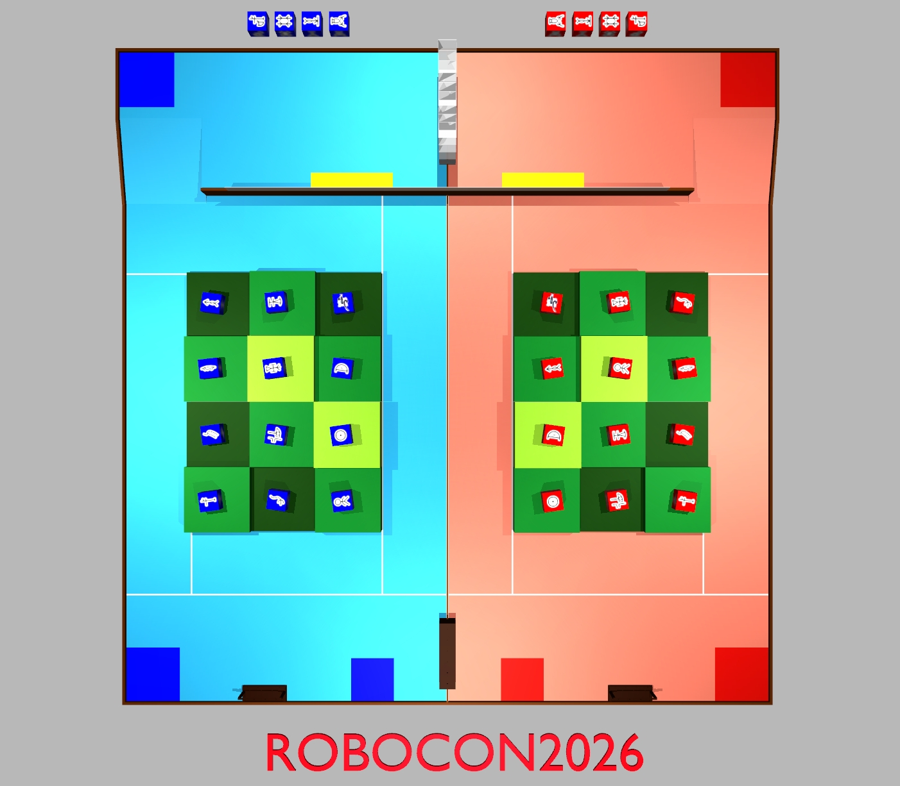
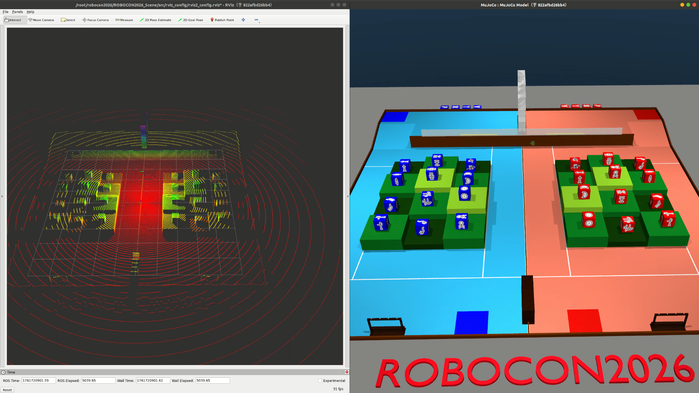

# ROBOCON2026 武林探秘 - MuJoCo仿真场景

第二十五届全国大学生机器人大赛ROBOCON"武林探秘"竞技赛MuJoCo仿真环境。



## 快速开始

### 环境要求
- Python >= 3.7
- MuJoCo物理引擎

### 安装依赖
```bash
pip install mujoco
```

### 启动仿真
```bash
# 请检查自己的mujoco版本
pip list | grep mujoco
# 如果是mujoco>=3.3.0 请使用以下的指令
python -m mujoco.viewer --mjcf models/mjcf/robocon2026.xml
# 如果是3.3.0之前的版本 则使用
python -m mujoco.viewer --mjcf models/mjcf/robocon2026_old.xml
```

## 激光雷达模拟

请先按照[LiDAR安装教程](https://github.com/TATP-233/MuJoCo-LiDAR/blob/main/README_zh.md#%E5%BF%AB%E9%80%9F%E5%AE%89%E8%A3%85)，安装好lidar模拟环境（推荐使用gpu后端）

```bash
cd ROBOCON2026_Scene
python src/lidar_sim.py
# 参考终端的指令:
# 1. 启动rviz2，可视化激光雷达点云
# 2. 鼠标操作，拖动绿色方块，控制激光雷达的位置
```



## 文件结构
```
ROBOCON2026_Scene/
├── README.md                   # 项目说明文档
├── assets/                     # 资源文件
│   └── image.png               # 场景预览图
├── models/
│   ├── meshes/                 # 3D模型文件
│   │   ├── kfs                 # 武功秘籍
│   │   ├── robocon2026.obj     # 主场景模型
│   │   ├── robocon2026.mtl     # 材质文件
│   │   ├── parts/              # 场景部件模型
│   │   └── visual/             # 可视化资源
│   └── mjcf/
│       ├── kfs.xml             # 武功秘籍
│       ├── kfs_dep.xml         # 武功秘籍资产依赖
│       ├── mocap_env.xml       # 用于显示激光雷达场景
│       ├── robocon2026.xml     # MuJoCo场景描述文件
│       └── robocon2026_old.xml # 适用于旧版mujoco
├── src
│   ├── lidar_sim.py            # 激光雷达模拟脚本
│   └── rviz_config             # rviz配置文件
│       └── rviz2_config.rviz
└── 第二十五届全国大学生机器人大赛ROBOCON_u201C武林探秘_u201D竞技赛规则V.1.pdf
```

## 相关链接
- [ROBOCON官网](http://robocon.org.cn/sys-index/)
- [MuJoCo文档](https://mujoco.readthedocs.io/)

## 致谢

感谢重庆邮电大学开源的[blender模型](https://rcbbs.top/t/topic/2261)。
