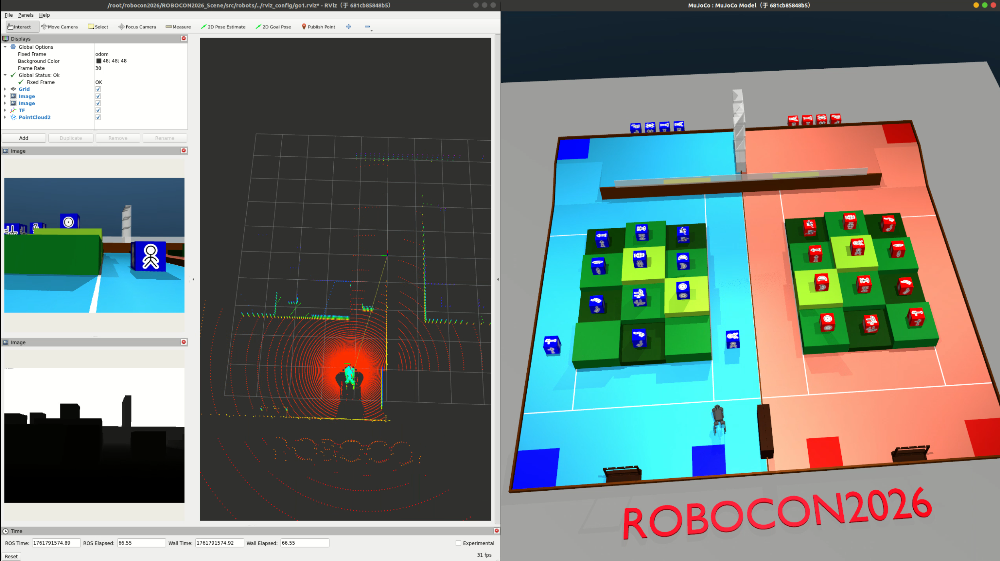

# ROBOCON2026 Martial Arts Quest - MuJoCo Simulation Scene

MuJoCo simulation environment for the 25th National College Student Robot Competition ROBOCON "Martial Arts Quest".

[中文文档](README_zh.md)


## Quick Start

### Requirements
- Python >= 3.7
- MuJoCo Physics Engine

### Install Dependencies
```bash
pip install mujoco
```

### Launch Simulation
```bash
# Check your mujoco version
pip list | grep mujoco
# If mujoco>=3.3.0, use the following command
python -m mujoco.viewer --mjcf models/mjcf/robocon2026.xml
# If version is before 3.3.0, use
python -m mujoco.viewer --mjcf models/mjcf/robocon2026_old.xml
```

## LiDAR Simulation

1. Please follow the [LiDAR Installation Tutorial](https://github.com/TATP-233/MuJoCo-LiDAR/blob/main/README_zh.md#%E5%BF%AB%E9%80%9F%E5%AE%89%E8%A3%85) to set up the lidar simulation environment (GPU backend recommended)

```bash
cd ROBOCON2026_Scene
python src/lidar_sim_native.py
```


2. For ROS2 integration, please install ROS2 environment first

```bash
cd ROBOCON2026_Scene
python src/lidar_sim_ros2.py
```


## Robot Motion Control Simulation

Based on reinforcement learning trained ONNX policy models, we provide motion control simulations for multiple mainstream robots, supporting real-time joystick interaction control and ROS2 interface integration. Currently supported robots include:

- **Unitree Robotics**: Go1 Quadruped Robot, G1 Humanoid Robot
- **Booster Robotics**: T1 Bipedal Humanoid Robot
- **Zjupower**: Tron A1 Bipedal Robot

### Environment Setup

Before running any robot control program, please install the necessary dependencies:

```bash
# Install ONNX runtime and joystick support
pip install onnxruntime pygame etils

# (Optional) Install ROS2 support for topic publishing
# Please refer to ROS2 official documentation to install the corresponding version
```

### Unitree Go2 Quadruped Robot

<!-- Go2 Demo Image -->


```bash
# Joystick control mode (Xbox controller recommended)
python3 src/robots/play_go2_joystick.py

# ROS2 topic mode (requires ROS2 installation)
python3 src/robots/play_go2_ros2.py

# Specify LiDAR type, we provide airy96 and mid360 LiDARs (default is airy96)
python3 src/robots/play_go2_ros2.py --lidar mid360
```

**Control Instructions**:
- `Left Stick`: Move forward/backward/left/right
- `Right Stick`: Rotate in place
- `Backspace`: Reset environment

### Unitree Go1 Quadruped Robot

<!-- Go1 Demo Image -->


```bash
# Joystick control mode
python3 src/robots/play_go1_joystick.py

# ROS2 topic mode
python3 src/robots/play_go1_ros2.py
```

### Unitree G1 Humanoid Robot

<!-- G1 Demo Image -->


```bash
# Joystick control mode
python3 src/robots/play_g1_joystick.py

# ROS2 topic mode
python3 src/robots/play_g1_ros2.py
```

### Booster T1 Bipedal Humanoid Robot

<!-- T1 Demo Image -->


```bash
# Joystick control mode
python3 src/robots/play_t1_joystick.py
```

### Tron Bipedal Robot

<!-- A1 Demo Image -->


```bash
# Joystick control mode
python3 src/robots/play_tron_joystick.py
```

Have fun!

## Use FastlIO2 for SLAM

1. The default setting uses ROS2 humble. If your version is different, please refer to the settings in `build_fastlio2.sh` for modification.

2. Grant execute permission

   ```bash
   chmod +x build_fastlio2.sh
   ```

3. run build script

   ```bash
   ./build_fastlio2.sh
   ```

4. source env

   ```bash
   cd ros2_ws
   source install/setup.bash
   ```

5. run Go2 scence

   ```bash
   python src/robots/play_go2_ros2.py 
   ```

2. run keyboard control node

   ```bash
   ros2 run teleop_twist_keyboard teleop_twist_keyboard 
   ```

7. launch FastLIO2

   ```bash
   ros2 launch ros2 launch fast_lio mapping.launch.py config_file:=go2_fastlio2.yaml
   ```


> [!note]
>
> If you need to adapt to other robots, simply modify the extrinsic parameters according to the model file.
>
> ```yaml
> extrinsic_T: [0.32057, 0.0, -0.11732]
> extrinsic_R: [  -0.9802,    0.,     0.1980,
>                 0.,         1.,     0.,
>                 -0.1980,    0.,     -0.9802]
> ```


### FAQ

**Q: Joystick not recognized?**  
A: Please ensure the joystick is connected and `pygame` is installed. Run `python -m pygame.examples.joystick` to test joystick connection.

**Q: How to customize robot models?**  
A: Modify the corresponding XML files in the `models/mjcf/` directory and retrain the policy model.

## File Structure
```
ROBOCON2026_Scene/
├── README.md                       # Project documentation
├── assets/                         # Resource files
├── models/
│   ├── meshes/                     # 3D model files
│   │   ├── kfs/                    # Martial arts manual models
│   │   ├── robocon2026.obj         # Main scene model
│   │   ├── robocon2026.mtl         # Material file
│   │   ├── parts/                  # Scene component models
│   │   └── visual/                 # Visualization resources
│   └── mjcf/                       # MuJoCo XML scene files
│       ├── robocon2026.xml         # Main scene (MuJoCo >= 3.3.0)
│       ├── robocon2026_old.xml     # Compatible with older MuJoCo versions
│       ├── mocap_env.xml           # LiDAR simulation scene
│       ├── kfs.xml                 # Martial arts manual scene
│       ├── kfs_dep.xml             # Martial arts manual asset dependencies
│       ├── scene_go1.xml           # Go1 robot scene
│       ├── scene_g1.xml            # G1 robot scene
│       ├── scene_t1.xml            # T1 robot scene
│       └── scene_a1.xml            # A1 robot scene
├── src/
│   ├── lidar_sim.py                # LiDAR simulation script
│   ├── robots/                     # Robot control scripts
│   │   ├── play_go1_joystick.py    # Go1 joystick control
│   │   ├── play_go1_ros2.py        # Go1 ROS2 interface
│   │   ├── play_g1_joystick.py     # G1 joystick control
│   │   ├── play_g1_ros2.py         # G1 ROS2 interface
│   │   ├── play_t1_joystick.py     # T1 joystick control
│   │   ├── play_a1_joystick.py     # A1 joystick control
│   │   ├── gamepad_reader.py       # Joystick reading module
│   │   ├── camera_utils.py         # Camera utility module
│   │   └── onnx/                   # ONNX policy model files
│   └── rviz_config/                # RViz configuration files
│       ├── g1.rviz
│       ├── go1.rviz
│       └── lidar.rviz
└── 第二十五届全国大学生机器人大赛ROBOCON_u201C武林探秘_u201D竞技赛规则V.1.pdf
```

## Related Links
- [ROBOCON Official Website](http://robocon.org.cn/sys-index/)
- [MuJoCo Documentation](https://mujoco.readthedocs.io/)

## Citation

The technology stack used in this repository is based on our simulator [DISCOVERSE](https://air-discoverse.github.io/). If this work is helpful to your research, please consider citing our paper:

```bibtex
@article{jia2025discoverse,
    title={DISCOVERSE: Efficient Robot Simulation in Complex High-Fidelity Environments},
    author={Yufei Jia and Guangyu Wang and Yuhang Dong and Junzhe Wu and Yupei Zeng and Haonan Lin and Zifan Wang and Haizhou Ge and Weibin Gu and Chuxuan Li and Ziming Wang and Yunjie Cheng and Wei Sui and Ruqi Huang and Guyue Zhou},
    journal={arXiv preprint arXiv:2507.21981},
    year={2025},
    url={https://arxiv.org/abs/2507.21981}
}
```

## Acknowledgments

Thanks to the following projects and contributors:

- Thanks to Chongqing University of Posts and Telecommunications for the open-source [scene Blender model](https://rcbbs.top/t/topic/2261)
- Thanks to DeepMind [MuJoCo Playground](https://github.com/google-deepmind/mujoco_playground) for providing robot motion control strategies and implementation references
- Thanks to the HKU MARS Lab for open-sourcing [FAST_LIO](https://github.com/hku-mars/FAST_LIO)
- Thanks to Livox for maintaining [Livox-SDK2](https://github.com/Livox-SDK/Livox-SDK2) and [livox_ros_driver2](https://github.com/Livox-SDK/livox_ros_driver2)
