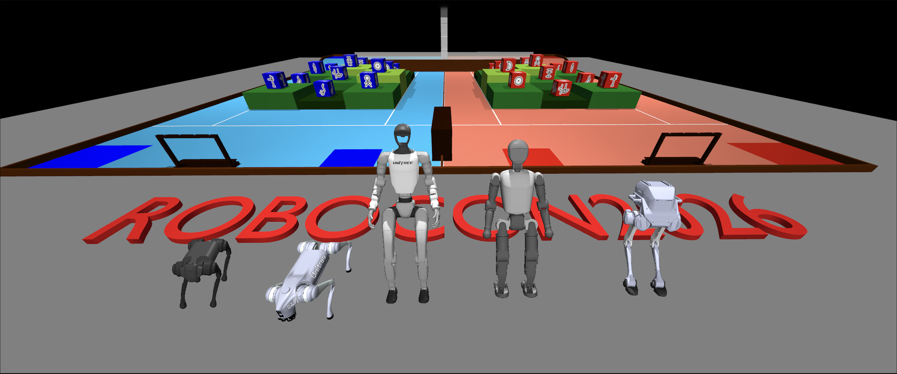

# ROBOCON2026 武林探秘 - MuJoCo仿真场景

第二十五届全国大学生机器人大赛ROBOCON"武林探秘"竞技赛MuJoCo仿真环境。

[English Document](README.md)




## 快速开始

### 环境要求
- Python >= 3.7
- MuJoCo物理引擎

### 安装依赖
```bash
pip install mujoco
```

### 启动仿真
```bash
# 请检查自己的mujoco版本
pip list | grep mujoco
# 如果是mujoco>=3.3.0 请使用以下的指令
python -m mujoco.viewer --mjcf models/mjcf/robocon2026.xml
# 如果是3.3.0之前的版本 则使用
python -m mujoco.viewer --mjcf models/mjcf/robocon2026_old.xml
```

## 激光雷达模拟

1. 请先按照[LiDAR安装教程](https://github.com/TATP-233/MuJoCo-LiDAR/blob/main/README_zh.md#%E5%BF%AB%E9%80%9F%E5%AE%89%E8%A3%85)，安装好lidar模拟环境（推荐使用gpu后端）

```bash
cd ROBOCON2026_Scene
#<<< 如果在conda环境里额外运行
conda install -c conda-forge libstdcxx-ng gcc
#>>> 如果在conda环境里额外运行
python src/lidar_sim_native.py
```


2. 集成ros2，需要先安装好ros2环境

```bash
cd ROBOCON2026_Scene
python src/lidar_sim_ros2.py
```


## 机器人运动控制模拟

我们基于强化学习训练的 ONNX 策略模型，提供了多款主流机器人的运动控制仿真，支持手柄实时交互控制和 ROS2 接口集成。目前支持的机器人包括：

- **宇树科技**：Go1 四足机器人、G1 人形机器人
- **Booster机器人**：T1 双足人形机器人
- **逐级动力**：Tron A1 双足机器人

### 环境准备

在运行任何机器人控制程序前，请先安装必要的依赖：

```bash
# 安装 ONNX 运行时和游戏手柄支持
pip install onnxruntime pygame etils

# （可选）安装 ROS2 支持，用于话题发布
# 请参考 ROS2 官方文档安装对应版本
```

### Unitree Go2 四足机器人

<!-- Go2 演示图片 -->


```bash
# 手柄控制模式（推荐使用 Xbox 手柄）
python3 src/robots/play_go2_joystick.py

# ROS2 话题模式（需要先安装 ROS2）
python3 src/robots/play_go2_ros2.py

# 指定激光雷达类型，我们提供了airy96和mid360两种激光雷达（默认使用airy96）
python3 src/robots/play_go2_ros2.py --lidar mid360
```

**控制说明**：
- `左摇杆`：前后左右移动
- `右摇杆`：原地旋转
- `Backspace`: 重置环境

### Unitree Go1 四足机器人

<!-- Go1 演示图片 -->


```bash
# 手柄控制模式
python3 src/robots/play_go1_joystick.py

# ROS2 话题模式
python3 src/robots/play_go1_ros2.py
```

### Unitree G1 人形机器人

<!-- G1 演示图片 -->


```bash
# 手柄控制模式
python3 src/robots/play_g1_joystick.py

# ROS2 话题模式
python3 src/robots/play_g1_ros2.py
```

### Booster T1 双足人形机器人

<!-- T1 演示图片 -->


```bash
# 手柄控制模式
python3 src/robots/play_t1_joystick.py
```

### Tron 双足机器人

<!-- A1 演示图片 -->


```bash
# 手柄控制模式
python3 src/robots/play_tron_joystick.py
```

玩的开心！

### 常见问题

**Q: 手柄无法识别？**  
A: 请确保手柄已连接并安装 `pygame`。运行 `python -m pygame.examples.joystick` 测试手柄连接。

**Q: 如何自定义机器人模型？**  
A: 修改 `models/mjcf/` 目录下对应的 XML 文件，并重新训练策略模型。

## 文件结构
```
ROBOCON2026_Scene/
├── README.md                       # 项目说明文档
├── assets/                         # 资源文件
├── models/
│   ├── meshes/                     # 3D 模型文件
│   │   ├── kfs/                    # 武功秘籍模型
│   │   ├── robocon2026.obj         # 主场景模型
│   │   ├── robocon2026.mtl         # 材质文件
│   │   ├── parts/                  # 场景部件模型
│   │   └── visual/                 # 可视化资源
│   └── mjcf/                       # MuJoCo XML 场景文件
│       ├── robocon2026.xml         # 主场景（MuJoCo >= 3.3.0）
│       ├── robocon2026_old.xml     # 兼容旧版本 MuJoCo
│       ├── mocap_env.xml           # 激光雷达仿真场景
│       ├── kfs.xml                 # 武功秘籍场景
│       ├── kfs_dep.xml             # 武功秘籍资产依赖
│       ├── scene_go1.xml           # Go1 机器人场景
│       ├── scene_g1.xml            # G1 机器人场景
│       ├── scene_t1.xml            # T1 机器人场景
│       └── scene_a1.xml            # A1 机器人场景
├── src/
│   ├── lidar_sim.py                # 激光雷达模拟脚本
│   ├── robots/                     # 机器人控制脚本
│   │   ├── play_go1_joystick.py    # Go1 手柄控制
│   │   ├── play_go1_ros2.py        # Go1 ROS2 接口
│   │   ├── play_g1_joystick.py     # G1 手柄控制
│   │   ├── play_g1_ros2.py         # G1 ROS2 接口
│   │   ├── play_t1_joystick.py     # T1 手柄控制
│   │   ├── play_a1_joystick.py     # A1 手柄控制
│   │   ├── gamepad_reader.py       # 游戏手柄读取模块
│   │   ├── camera_utils.py         # 相机工具模块
│   │   └── onnx/                   # ONNX 策略模型文件
│   └── rviz_config/                # RViz 配置文件
│       ├── g1.rviz
│       ├── go1.rviz
│       └── lidar.rviz
└── 第二十五届全国大学生机器人大赛ROBOCON_u201C武林探秘_u201D竞技赛规则V.1.pdf
```

## 相关链接
- [ROBOCON官网](http://robocon.org.cn/sys-index/)
- [MuJoCo文档](https://mujoco.readthedocs.io/)

## 引用

本仓库使用的技术栈基于我们的仿真器[DISOCVERSE](https://air-discoverse.github.io/)，如果本工作对您的研究有帮助的话，请考虑引用我们的论文：

```bibtex
@article{jia2025discoverse,
    title={DISCOVERSE: Efficient Robot Simulation in Complex High-Fidelity Environments},
    author={Yufei Jia and Guangyu Wang and Yuhang Dong and Junzhe Wu and Yupei Zeng and Haonan Lin and Zifan Wang and Haizhou Ge and Weibin Gu and Chuxuan Li and Ziming Wang and Yunjie Cheng and Wei Sui and Ruqi Huang and Guyue Zhou},
    journal={arXiv preprint arXiv:2507.21981},
    year={2025},
    url={https://arxiv.org/abs/2507.21981}
}
```

## 致谢

感谢以下项目和贡献者：

- 感谢重庆邮电大学开源的[场景 Blender 模型](https://rcbbs.top/t/topic/2261)
- 感谢 DeepMind [MuJoCo Playground](https://github.com/google-deepmind/mujoco_playground) 提供的机器人运动控制策略和实现参考
